# Chidori 拡張キット組立説明書

**Chidori拡張キットは単体では動作しません。Chidori本体に接続してご使用ください。**

## 組み立ての前に
* はんだごてや工具、部品等でのケガに注意してください。
* 作業中に席を離れるときは、はんだごての電源を確認してください。
* 非常に小さい部品が含まれていますので、失くさないように注意してください。

## 内容物の確認
キットには以下の部品が含まれています。作業前に不足がないか確認してください。

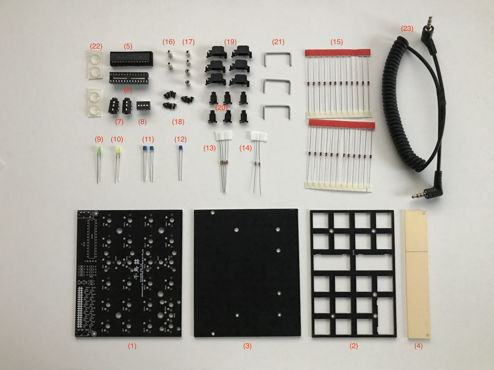

番号 | 画像 | 名前      | 値     | 個数 | 備考                | 部品番号
:----|:------|:--------|:-----|:----|:-----------------|:-------
1 |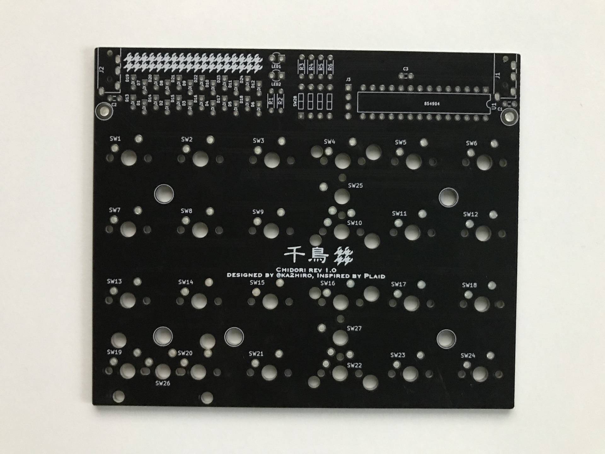| PCB      |       | 1    |          |
2 || トッププレート |  | 1 |           |
3 || ボトムプレート |     | 1 |        | 
4 |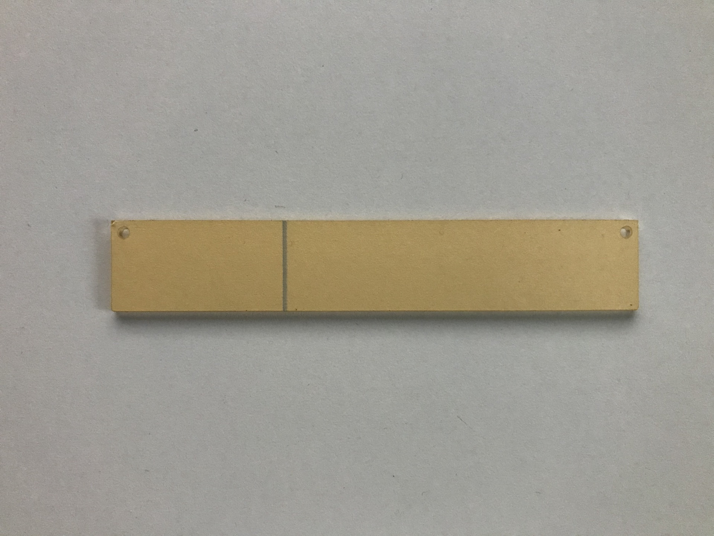| アクリルプレート |  | 1 |        |
5 || I2C IO エキスパンダー| MCP23017 | 1 |  | U1 
6 || ICソケット |  | 1 |   |
7 |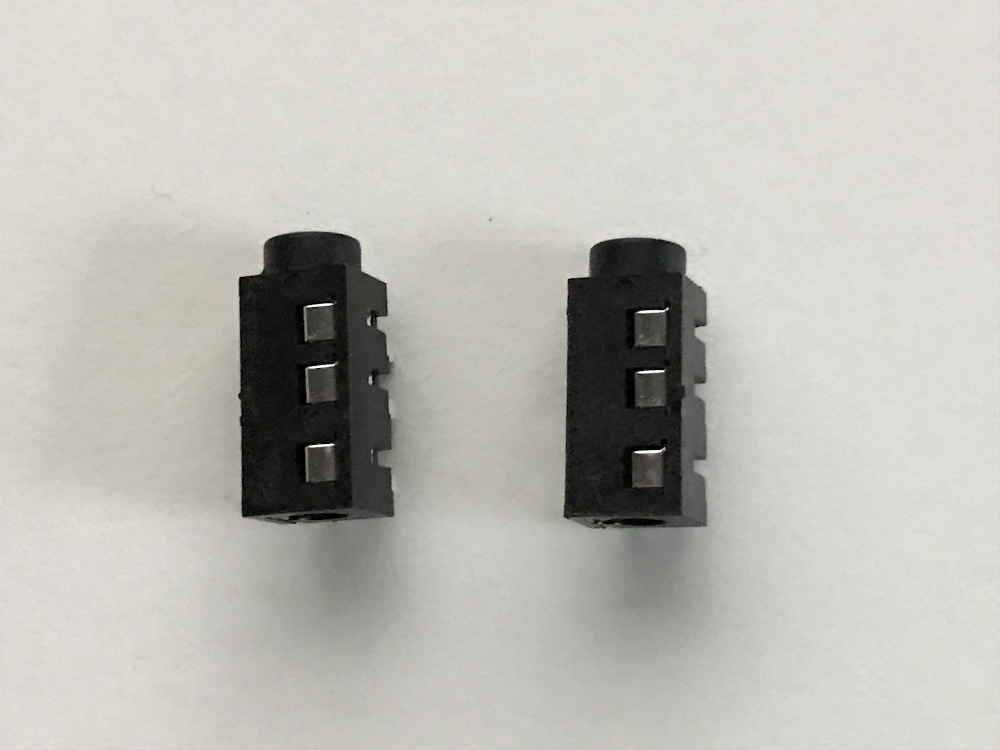| TRRS ジャック | MJ-4PP-9 | 2 | | J1, J2 
8 |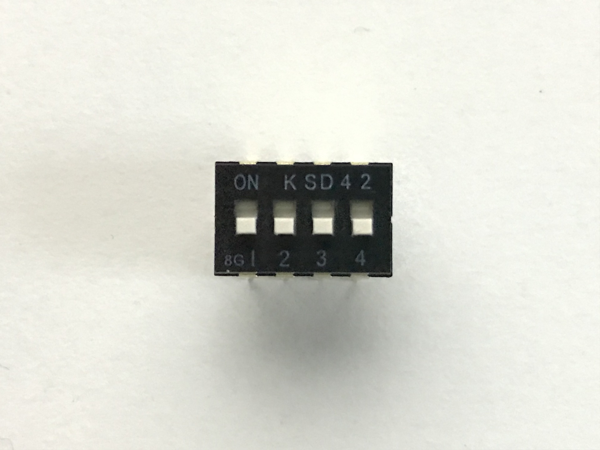| DIPスイッチ | KSD42 | 1 | |SW28 
9 || LED（緑） | OSG8HA3Z74A | 1 |   | LED1
10 || LED（黄） | OSY5JA3Z74A | 1 |   | LED1 
11 || コンデンサ | 1μF | 2 | 本体に105と表記 | C1, C2 
12 |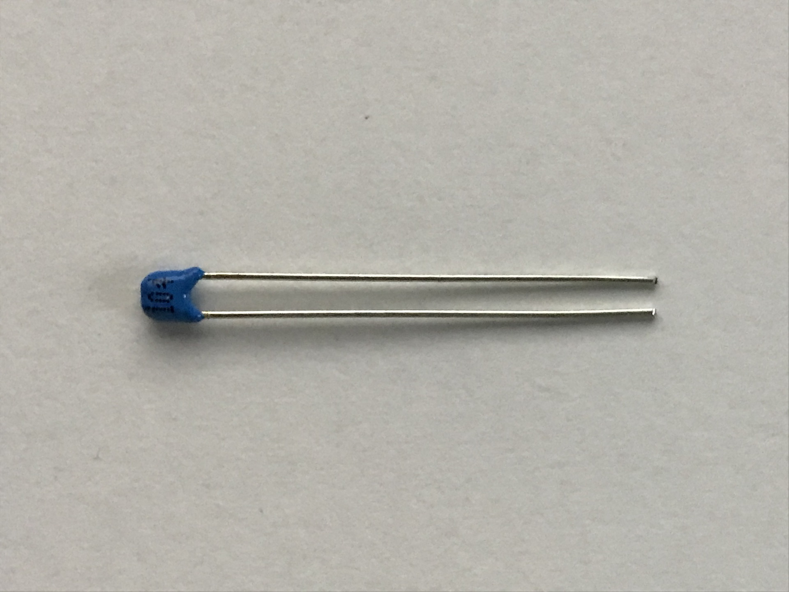| コンデンサ | 0.1μF | 1 | 本体に104と表記 | C3 
13 |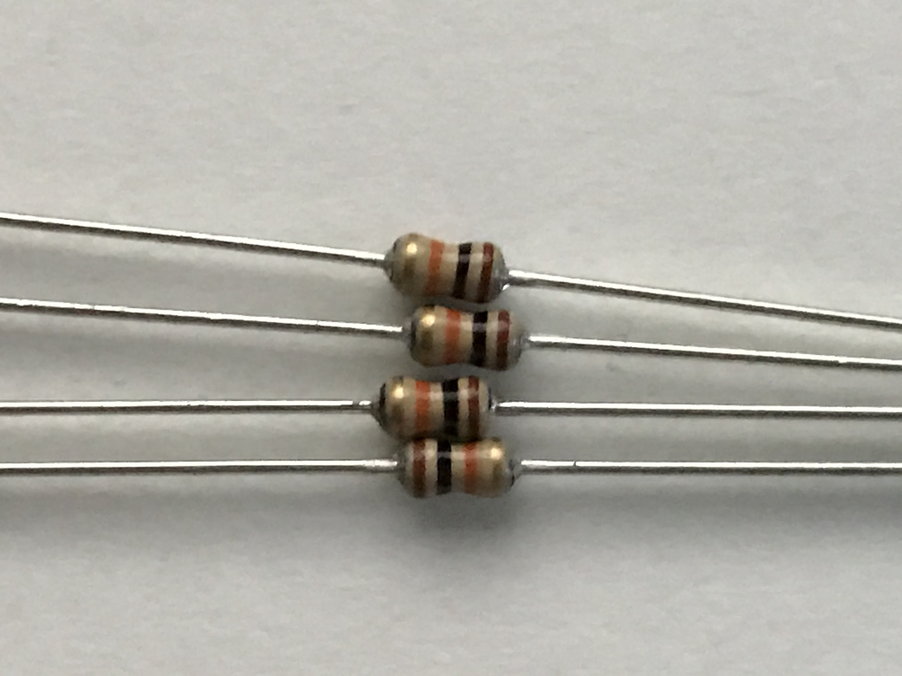| 抵抗 | 10kΩ | 4 | カラーコードは茶黒橙金  | R3, R4, R5, R6 
14 || 抵抗 | 5.1kΩ | 2 | カラーコードは緑茶赤金 |  R1, R2 
15 || ダイオード | 1N4148 | 24 |            | D1 - D24 
16 |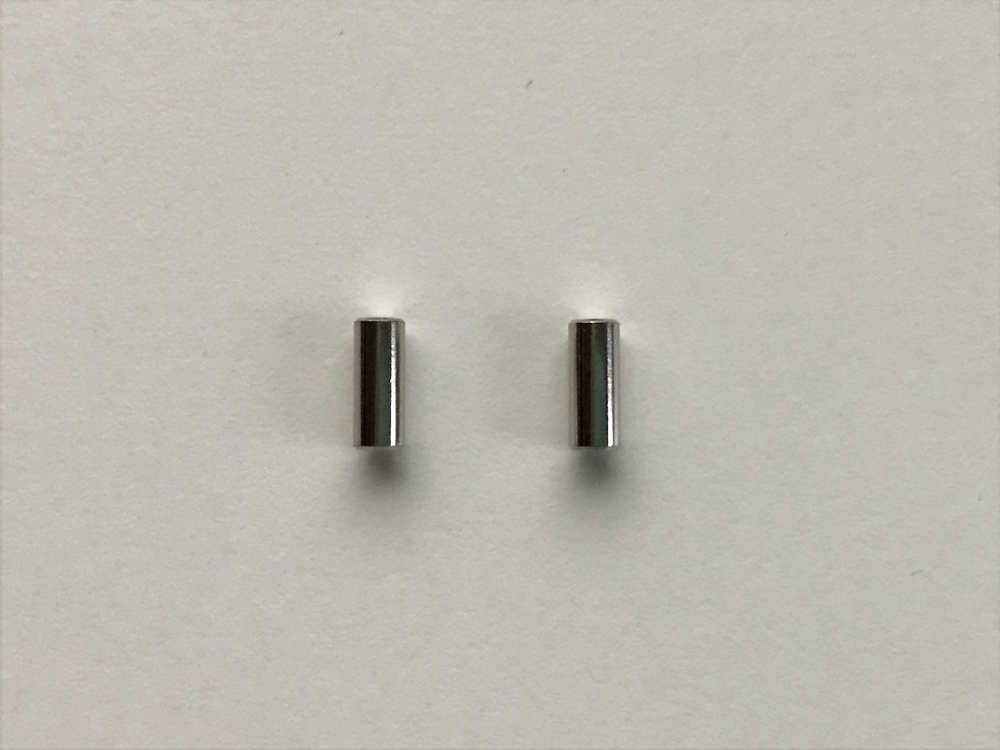| M2スペーサ | 10mm | 2 |                   | 
17 || M2スペーサ | 7mm | 4 |                   |
18 || M2ネジ    | 4mm | 12 |                   |
19 || スタビライザ台座 |   | 6 |    |
20 || スタビライザ軸 |   | 6 |    |
21 || スタビライザワイヤ |   | 3 |    |
22 || ゴム足 |      | 4 |                |
23 || TRRSケーブル  |       | 1 |     | 

## その他に必要なもの
キットを完成させるためには、以下の部品を別途用意する必要があります。

* キースイッチ（Cherry MX互換スイッチ）
* キーキャップ

## 作業に必要な工具
組立作業には、最低限以下の工具が必要となります。

* はんだごて（温度調節できるものが望ましい）
* はんだ
* ピンセット
* プラス(+)ドライバ
* ルーペ
* フラックス
* テスタ

その他、必要に応じて以下も用意すると良いです。

* フラックス洗浄剤
* はんだ吸取線または吸取機

## 組み立て時の注意
* 取り付ける向きに注意が必要な部品があります。手順にその旨記載されている場合は、よく確認して作業してください。

## 抵抗をつける

1. 抵抗R1〜R6をはんだ付けします。

## コンデンサをつける
1. コンデンサC1〜C3を半田付けします。

## ダイオードをつける
**ダイオードには向きがありますので注意してください。**

1. ダイオードは縦に実装しますので、あらかじめ次の画像のように、カソード（黒いバーのある側）のリードを曲げておきます。

2. PCBにダイオードを取り付ける際は、丸いランドの上に本体が来るよう差し込みます。

3. ダイオードD1からD24をはんだ付けします。

## LEDをつける
**LEDには向きがありますので注意してください**

1. LED1（緑）, LED2（黄）を半田付けします。リードの長い方が丸いパッドの方を向くように取り付けてください。

## DIPスイッチをつける
1. DIPスイッチを半田付けします。
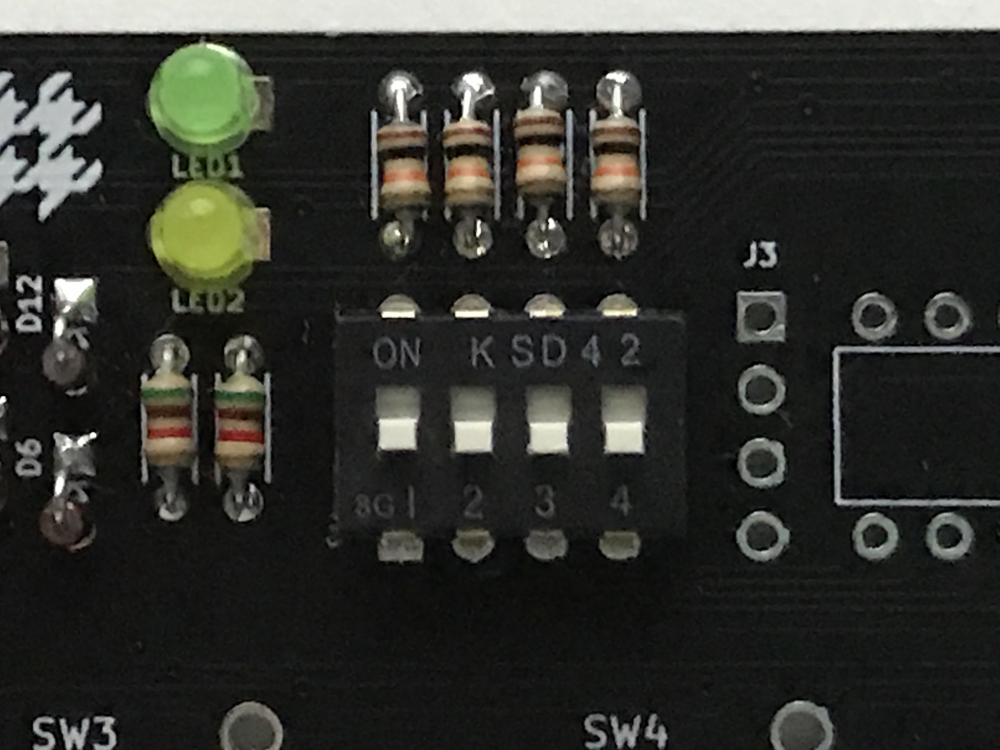

2. DIPスイッチの設定は以下の通り、1をOff（下）、2から4をOn（上）にします。

## TRRSジャックをつける
1. TRRSジャックを半田付けします。
  

  

## ICソケットをつける
**ICソケットには向きがありますので注意してください。**

1. ICソケットを半田付けします。ICソケットの切り欠きが右に向くように取り付けてください。

## MCP23017をつける
**ICには向きがありますので注意してください**

1. ICソケットにMCP23017を差し込みます。
2. ICのピンはICソケットより広がっているので、少し内側に曲げてから差し込みます。
3. ICの向きを間違えないよう、ICと ICソケットの切り欠きの位置を合わせてください。（画像はATMEGA328Pのものですが、MCP23017でも切り欠きの位置は同じです）

## 正しくはんだ付けされているか確認する
回路図( [拡張キット](files/chidori_slave.pdf))を参考に、正しくはんだ付けされているか確認します。

コンピュータに接続する前に、少なくとも以下の項目は確認しましょう。

1. VCCーGND間がショートしていないことを確認します。
2. MCP23017、電解コンデンサ、LED、ダイオードが正しい向きに取り付けられていることを確認します。

## スタビライザを組み立てる
1. スタビライザの軸には、穴が2つ空いている側（写真右）と1つの側（写真左）があります。2つの側の下の穴にワイヤが挿入されます。

2. スタビライザの軸には、ワイヤを取り付ける部分があります。
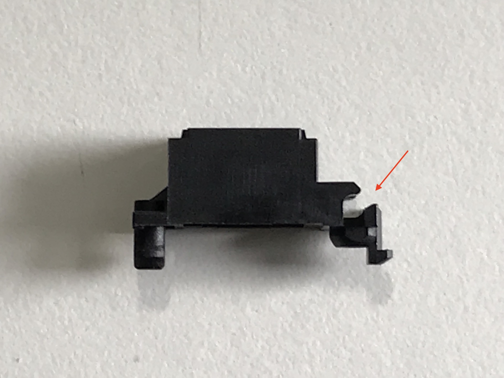
3. スタビライザの軸の2つ穴が空いている側と、スタビライザの台座のワイヤを取り付ける部分の向きを揃えて、台座の下から軸を挿入します。

4. 軸の下の穴にワイヤの片側を挿入します。

5. 台座を側面から見て、ワイヤを手前に90度倒し、台座のワイヤ受けにカチッとはめ込みます。

6. 反対側も同様に組み立てます。

## スタビライザをつける

1. スタビライザの取り付け可能な位置は3箇所ありますが、全て取り付ける必要はありません。お好きな場所を選んで取り付けることが可能です。
2. スタビライザ取付位置には、4つの穴が空いていて、上下（左右）のどちらか2つが大きくなっています。大きい穴の方にスタビライザのワイヤ部分が向くように配置し、先に大きい穴の方を差し込み、次に小さい穴の方を差し込みます。
3. 浮きやズレがなく取り付けられているか確認します。

## スイッチをつける
1. スイッチをトッププレートにはめ込みます。

2. トッププレートとPCBを組み合わせます。
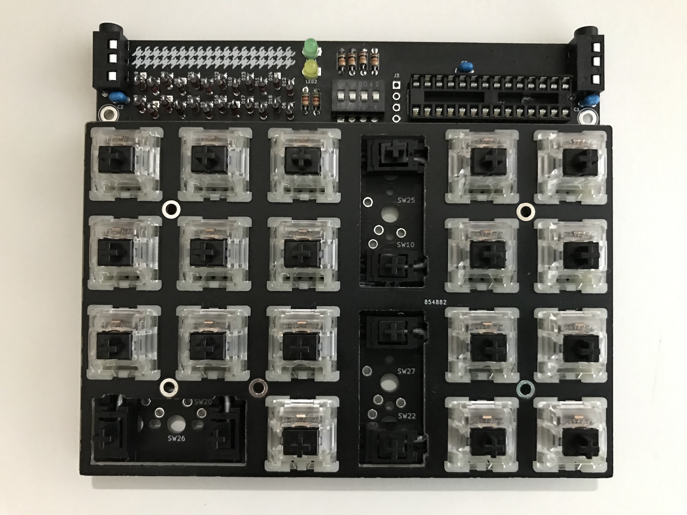

3. 残りのキースイッチをトッププレートにはめ込みます。

4. PCBにしっかりと押し込み、キースイッチの底面がPCBから浮いていないか確認してから、はんだ付けします。

## アクリルプレート用のスペーサをつける
1. TRRSジャックの近くにあるねじ穴に、アクリルプレート用のスペーサM2x10mmを取り付けます。

## ボトムプレートをつける
1. ボトムプレートはリバーシブルになっていますので、お好みの面を外側にしてお使いいただけます。最下段左側のねじ穴は、スタビライザと干渉するので、ひとつ右側のねじ穴を使います。
2. M2x4mmねじをボトムプレートに差し込み、スペーサを取り付けます。
  
3. ボトムプレートの上にトッププレートとPCBを重ね合わせ、M2x4mmねじで留めます。
  

## ゴム足をつける
1. ゴム足をボトムプレートにつけます。

## キーキャップをつける
1. お好みのキーキャップを取り付けます。

## ファームウェアを書き込む
ファームウェアはQMKを利用します。QMK本体にはまだマージされていませんので、以下のリポジトリをクローンし、"chidori_support" ブランチをチェックアウトしてビルドしてください。

[qmk_firmware](https://github.com/ka2hiro/qmk_firmware)

チェックアウトしたら、ローカルリポジトリのディレクトリへ移動してください。

次にキーボードをコンピュータに接続し、ブートローダモードに入ってください。

拡張キットを接続して3分割構成にする場合は、"extended"という名前のキーマップを使用します。

以下のコマンドを実行すると、ファームウェアの書き込みが始まります。書き込みに失敗する場合は、再度コマンドを実行してみてください。

~~~
$ make chidori:extended:usbasp
~~~

書き込みが完了したら、RESETスイッチ（白）を押して、ブートローダモードから抜けてください。

ファームウェアをビルドする環境の構築は、[こちらのドキュメント](https://docs.qmk.fm/#/getting_started_build_tools)を参考にしてください。

## 完成！
アクリルカバーをつけると完成です。おつかれさまでした。
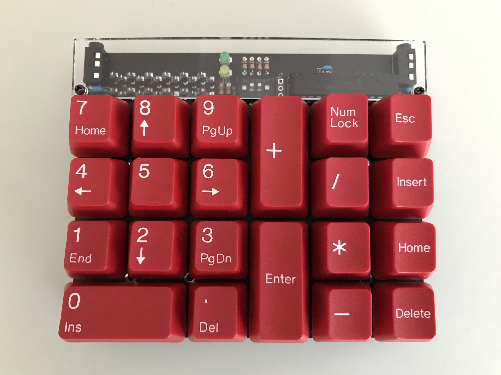

