# Chidori expansion kit build guide
**Chidori expansion kit does not work alone. It works by connecting to Chidori.**

Please refer to [here](https://github.com/ka2hiro/chidori_build_guide/blob/master/README_en.md) for Chidori build guide.

## Before build

* Please be aware of injuries with soldering irons, tools, parts etc.
* When you leave your seat during work, please confirm that the soldering iron is turned off.
* Very small parts are included, so be careful not to lose.

## Confirm contents

The following parts are included in the kit. Please check whether there is any shortage before work.

Number | Image | Name   | Value | Qty | Remarks         | Place 
:----|:------|:--------|:-----|:----|:-----------------|:-------
1 || PCB      |       | 1    |       |
2 |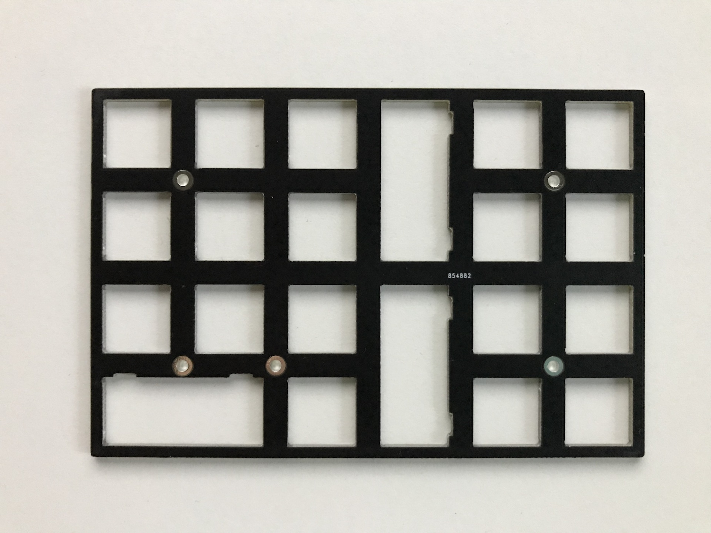| Top plate |  | 1 |           |
3 || Bottom plate |     | 1 |        |
4 || Acrylic  plate |  | 1 |        |
5 |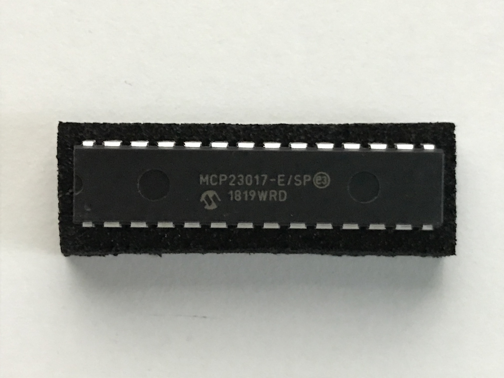| I2C IO Expander | MCP23017 | 1 |  | U1 
6 |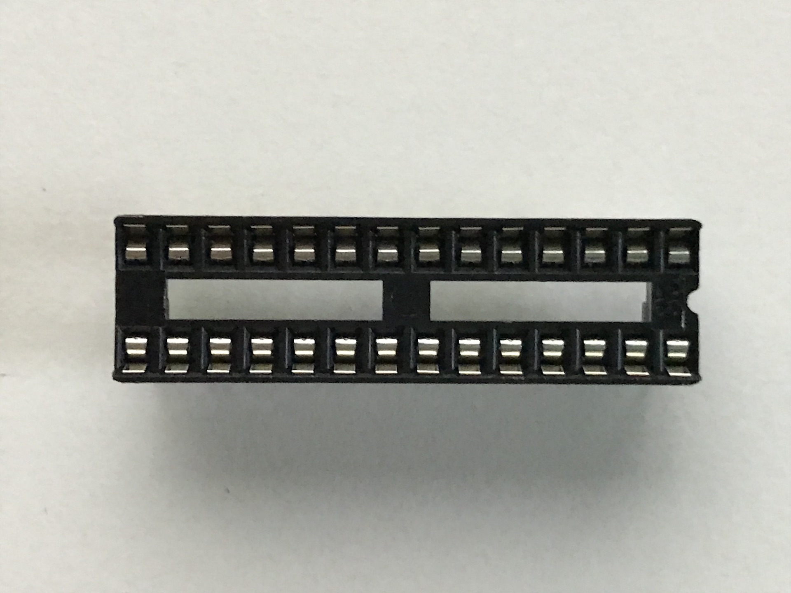| IC Sockets |  | 1 |   | 
7 || TRRS Jack | MJ-4PP-9 | 2 | |  J1, J2 
8 || DIP Switch | KSD42 | 1 | | SW28 
9 || LED(gr) | OSG8HA3Z74A | 1 |   | LED1 
10 || LED(yl) | OSY5JA3Z74A | 1 |   | LED1 
11 || Capacitor | 1μF | 2 | Marked "105" on the package. | C1, C2 
12 || Capacitor | 0.1μF | 1 | Marked  "104" on the package. | C3 
13 || Resistor | 10kΩ | 4 | The color code is brown,  black,  orange,  gold. | R3, R4, R5, R6 
14 |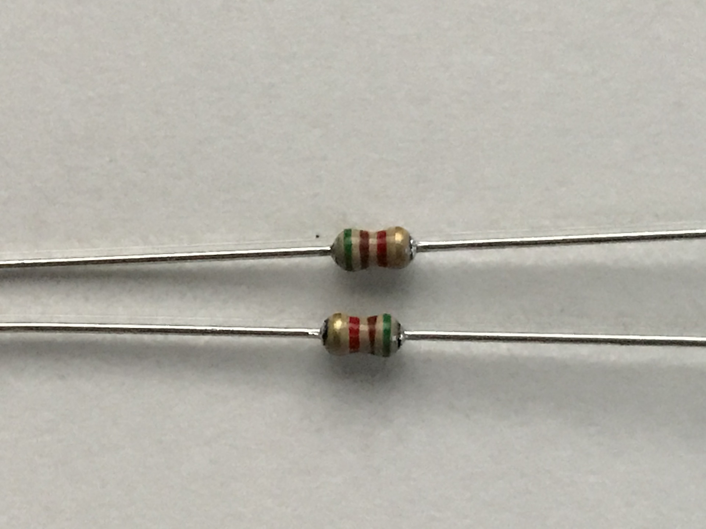| Resistor | 5.1kΩ | 2 | The color code is green, brown, red, gold. | R1, R2 
15 || Diode | 1N4148 | 24 |     | D1 - D24 
16 || M2 standoff | 10mm | 2 |                   | 
17 || M2 standoff | 7mm | 4 |                   |
18 |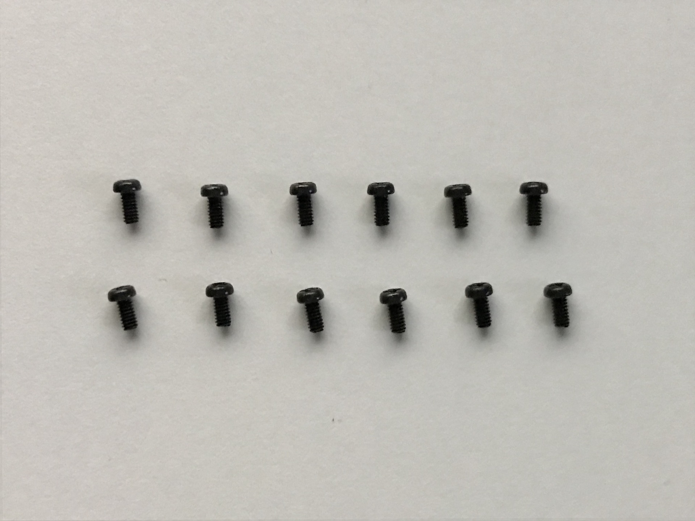| M2 screw | 4mm | 12 |                   |
19 |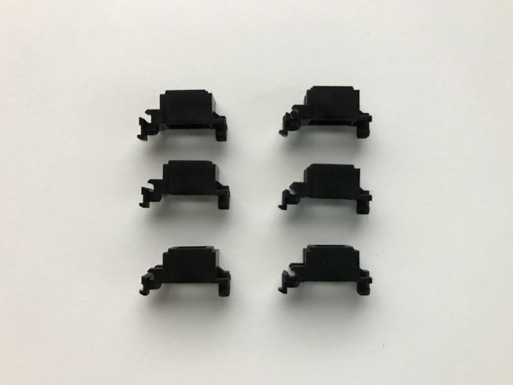| Stabilizer base |   | 6 |    |
20 |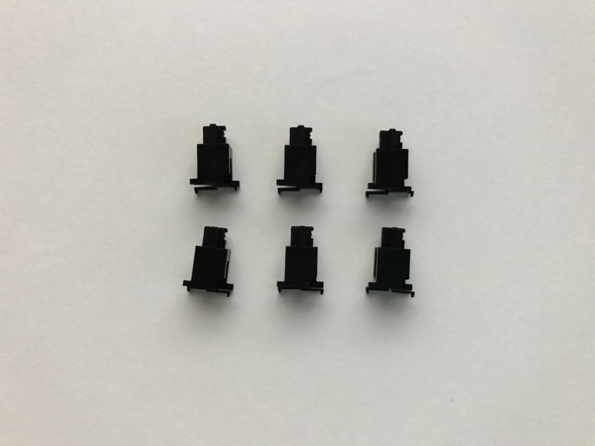| Stabilizer shaft |   | 6 |    |
21 || Stabilizer wire |   | 3 |    |
22 |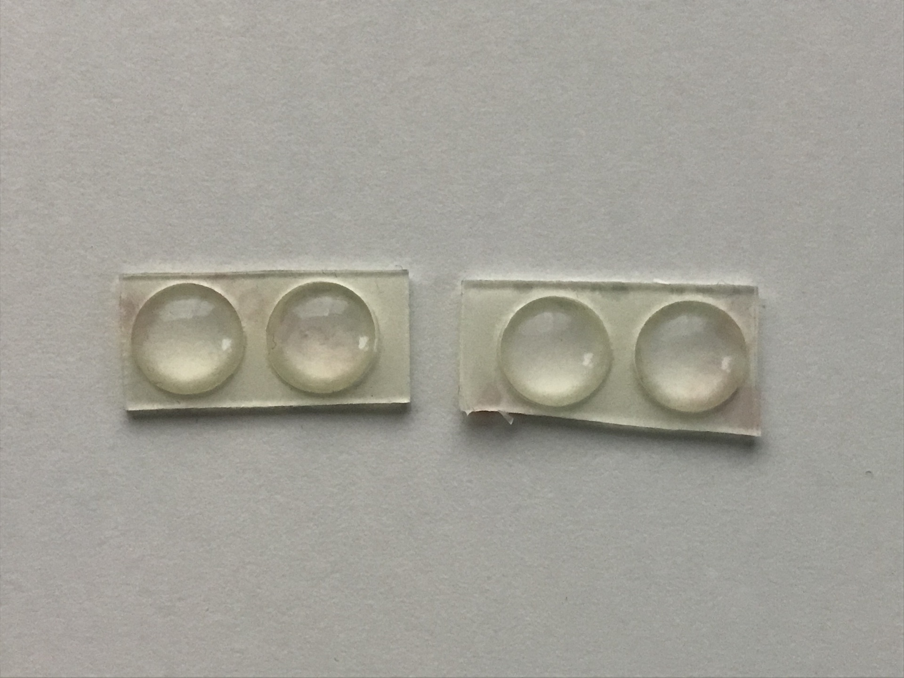| Rubber feet |      | 8 |                |
23 |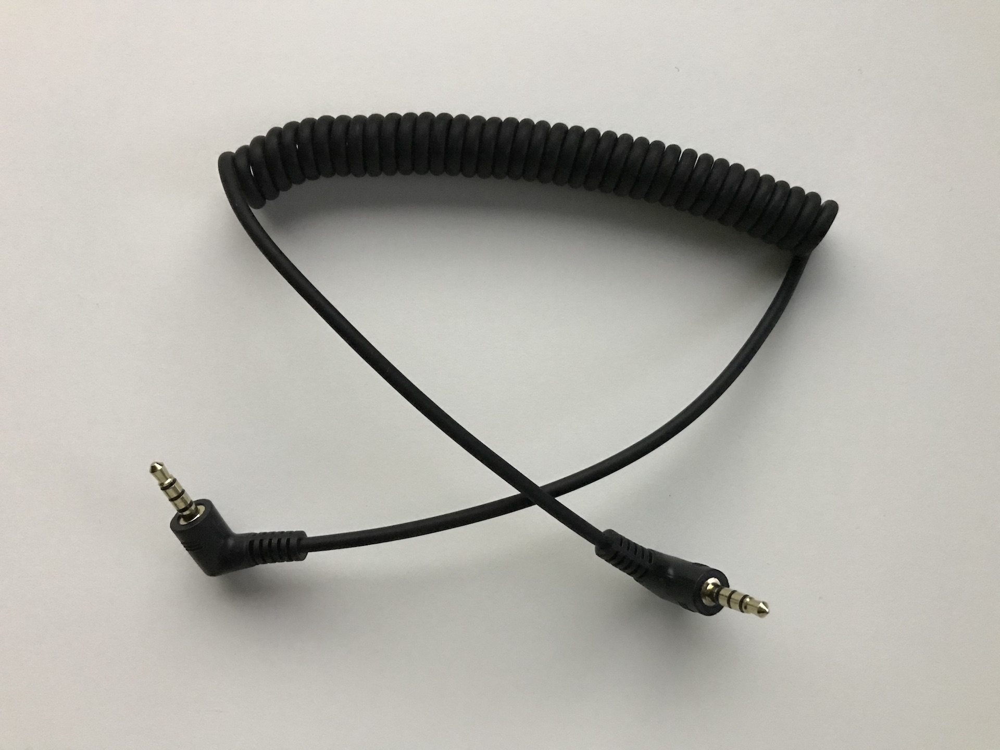| TRRS cable |       | 1 |     |

## Other required items

  * In order to complete the kit, the following parts must be prepared separately.

    * Key switch (Cherry MX compatible only support)
    * Key caps

  

  ## Required tools

  In order to build, the following tools are required at minimum.

  * Soldering iron (preferred temperature controllable)
  * Lead solder
  * Tweezers
  * Phillips head screwdriver
  * Magnifier
  * Flux
  * Multimeter

  In addition, you may also prepare the following as necessary.

  * Flux remover
  * Solder wick

## Precautions when assembling

* Some components require attention in the mounting direction. If this is indicated in the procedure, check the orientation of the parts carefully before working.

## Solder resistors

1. Solder the resistors R1 to R8.

## Solder the capacitor

1. Solder the capacitors C1 to C3.

## Solder diode

**Note that the diode has a direction. **

1. Since the diode is mounted vertically, bend the cathode (the side with the black bar) lead in advance as shown in the following image.

2. When mounting the diode on the PCB, insert it so that the body is on the round land.

3. Solder the diodes D1 to D24.

## Solder LED
**Note that LED has a direction.**

1. Solder LED1 (green) and LED2 (yellow). Make sure that the longer lead faces the round pad.

## Solder the DIP switch
1. Solder the DIP switch.

2. Set the DIP switches as follows, setting 1 to Off (down), 2 and 3 to On (up) and 4 to Off (down).

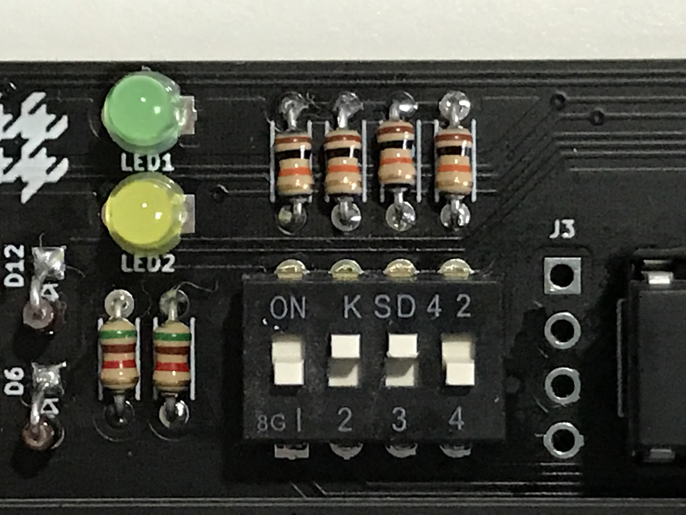

## Solder the TRRS jack
1. Solder the TRRS jack.

## Solder IC socket
**Note that the IC socket has a direction.**

1. Solder the IC socket. Attach the notch of the IC socket to the right side.

## Insert MCP23017
**Note that the IC has a direction.**

1. Insert MCP23017 into the IC socket.
2. Since the IC pins are wider than the IC socket, bend them slightly inward before inserting.
3. Align the notch on the IC with the IC socket so that the direction of the IC is correct.

## Check whether the soldering is properly done
Refer to the schematic ([expansion kit](files/chidori_slave.pdf)) and check whether soldering is correctly done.

Before connecting to the computer, at least check the followings.

1. Check that there is no short circuit between UVCC - GND and VCC - GND.
2. Make sure the MCP23017, electrolytic capacitors, LEDs, and diodes are installed in the correct orientation.

## Assemble the stabilizers

1. The stabilizer shaft has two hole sides (right side of the photo) and one hole side (left side of the photo). The wire is inserted into the lower hole on the 2 hole side.

2. The stabilizer shaft has a wire attachment part.

3. First, align the 2-hole side of the stabilizer shaft with the wire mounting part of the stabilizer pedestal, and then insert the shaft from the bottom of the pedestal.

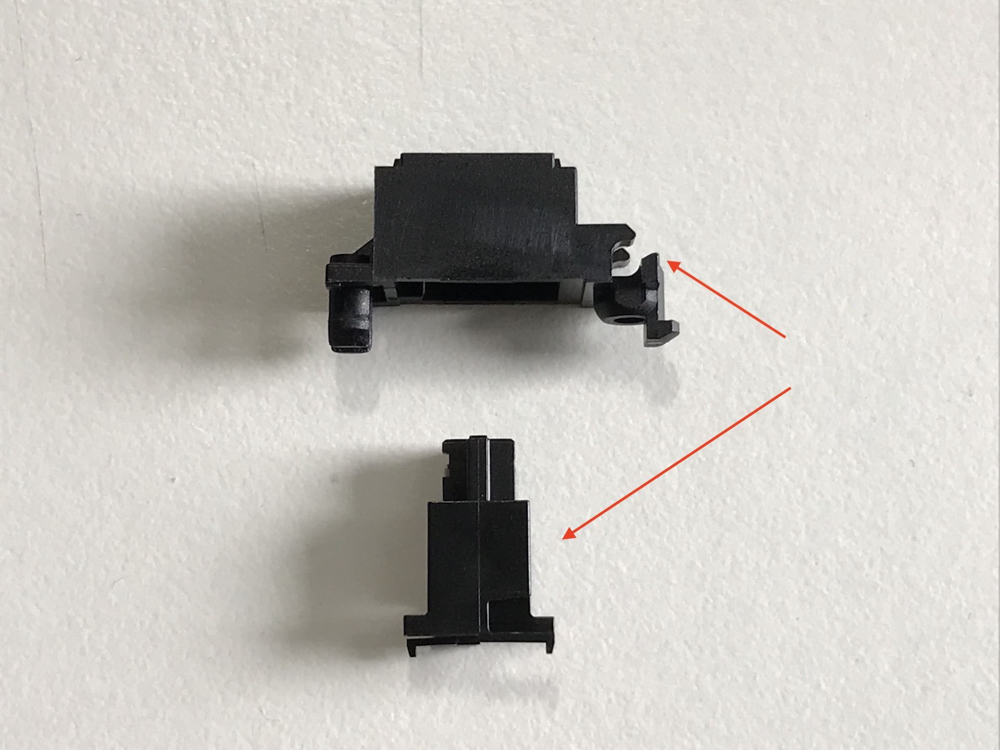
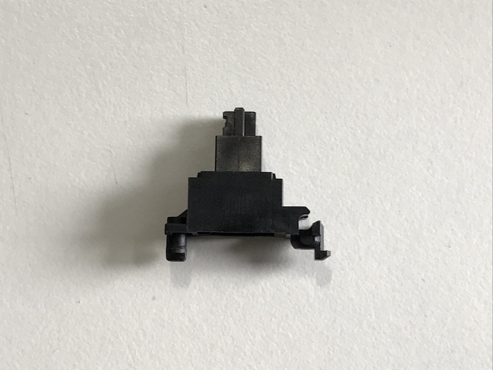

4. Insert one side of the wire into the lower hole in the shaft.

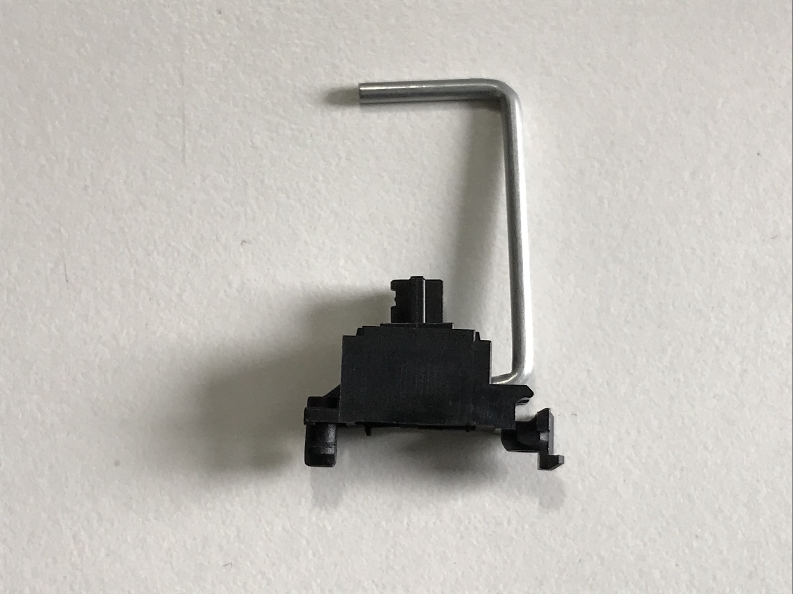

5. When viewing the pedestal from the side, tilt the wire 90 degrees toward you and snap it into the pedestal wire holder.

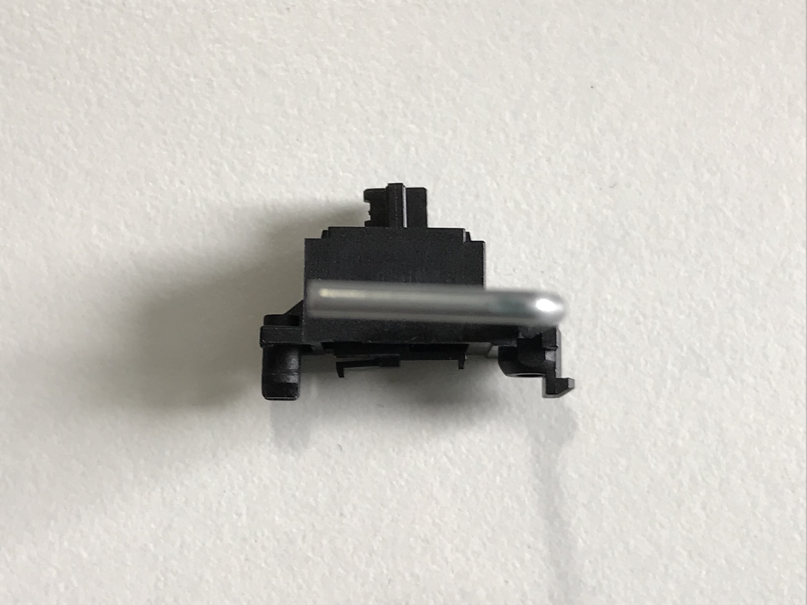
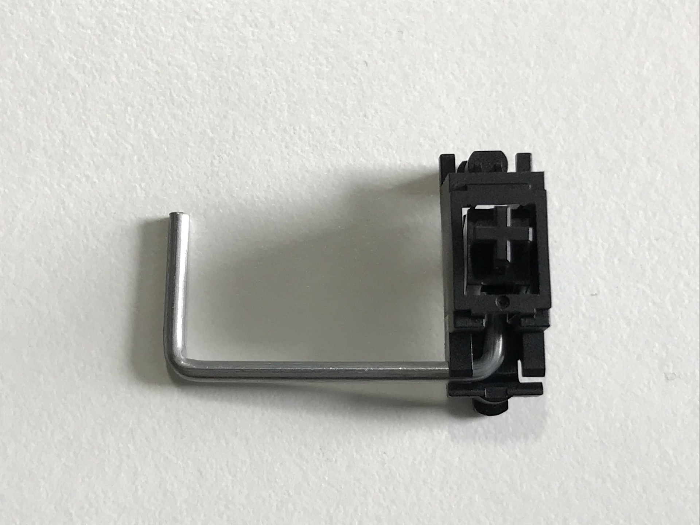

6. Repeat the above steps for the other side.

## Install the stabilizer

1. There are three locations where stabilizers can be installed, but not all need to be installed. It is possible to select the place you like and attach it.
2. On the PCB, there are four holes each in the position where the stabilizer is installed, and two of the four holes are larger. Align the stabilizer wire with the larger hole, insert the stabilizer into the larger hole, and then insert the smaller hole.
3. Check that it is installed without floating or misalignment.

## Attach the key switches to the top plate
1. Attache the key switches to the top plate. Do not attach the key switch to the place where the stabilizer is installed. Attach the key switch after combining with the PCB.

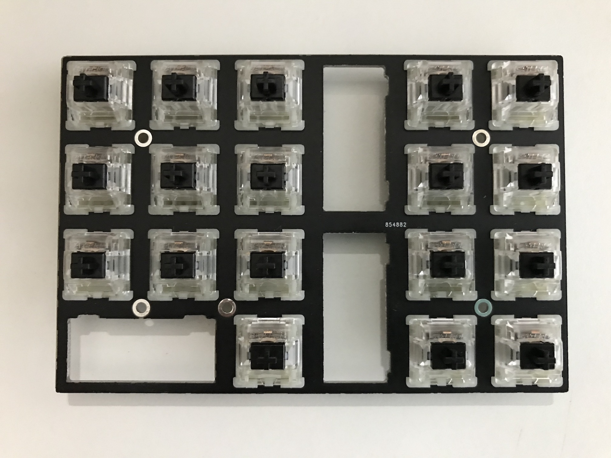

2. Combine the PCB and the top plate.

3. Attach the remaining key switches to the top plate.

4. Push the keyswitches firmly into the PCB, make sure the bottom of the keyswitches does not float off the PCB, and then solder them.

## Attache the stand off for acrylic plate
1. Attache the stand off M2x10mm for the acrylic plate to the screw hole near the TRRS jack. 

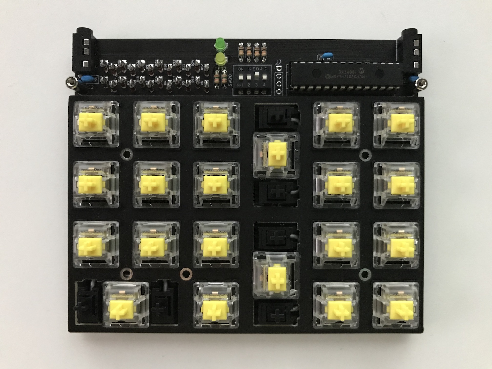

## Attache the bottom plate
1. The bottom plate is reversible, so you can use it with your favorite side facing out. Since the bottom left screw hole interferes with the stabilizer, use the one right screw hole.
2. Insert the M2x4mm screw into the bottom plate and attach the stand off.

  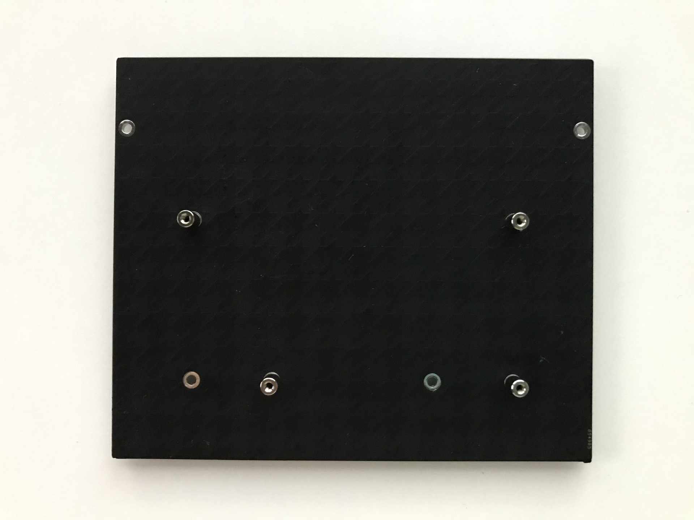

3. Combine the top plate and PCB on the bottom plate and screw them with M2x4mm.

  

## Attach the rubber feet
1. Attach the rubber feet to the bottom plate.

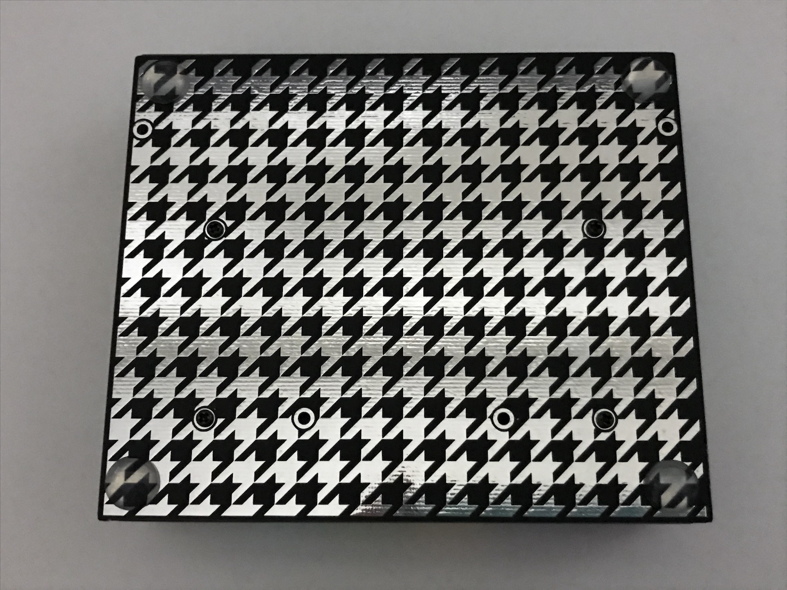

## Attach the keycaps
1. Attach your favorite keycaps.

## Write firmware
The firmware uses QMK. Clone the following repository.

[qmk_firmware](https://github.com/qmk/qmk_firmware)

After cloning, go to the directory of your local repository.

Then connect the keyboard to the computer and enter boot loader mode.

Execute the following command to start writing the firmware. If writing fails, try running the command again.

~~~
$ make chidori:extended:usbasp
~~~

When writing is completed, press the RESET switch (white) to exit the boot loader mode.

Refer to [this document](https://docs.qmk.fm/#/getting_started_build_tools) for how to build the environment for building firmware.

## Completed!
Attach the acrylic cover and you're done. Congrarulation!

